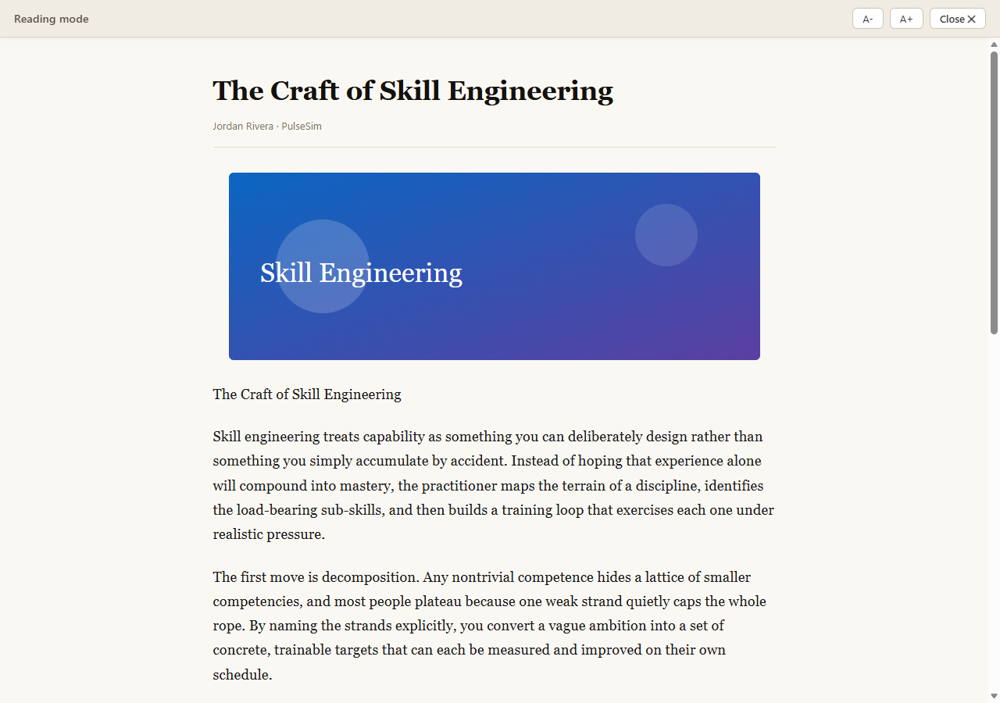

# Force Reading Mode (Microsoft Edge extension)

Some sites — LinkedIn articles are the classic example — structure their pages so
Microsoft Edge's built-in **Immersive Reader** (F9) never activates. The reader button
stays greyed out and F9 does nothing, so you can't read the article distraction‑free
or with a comfortable layout.

**Force Reading Mode** fixes that. It's a Manifest V3 extension that extracts the main
article with Mozilla's [Readability](https://github.com/mozilla/readability) engine — the
same one that powers Firefox Reader View — and renders it in a clean, full‑screen reading
overlay **with images**, on *any* page, including ones that block the native reader.



## Why not just force Edge's native reader?

Edge's Immersive Reader is a proprietary browser feature. There is **no extension API** to
turn it on, and no DOM hook to detect it. When Edge's heuristics decide a page isn't an
"article," pressing F9 is a no‑op and an extension cannot override that decision.

So instead of fighting an inaccessible feature, this extension provides its **own**
Immersive‑Reader‑style view that we fully control. It works everywhere and preserves images.

## Features

- Works on sites that block the native reader (LinkedIn, etc.).
- Extracts title, byline and article body **with inline images and figures**.
- Style‑isolated overlay (Shadow DOM) so the host page's CSS can't interfere.
- Font size controls (A− / A+), Esc / Close to exit, page scroll locked while reading.
- Three ways to trigger: toolbar button, **Alt+R**, and a `force-reading-mode:*` DOM event.

## Install (load unpacked)

1. Open Edge and go to `edge://extensions`.
2. Turn on **Developer mode** (bottom‑left).
3. Click **Load unpacked** and select the `extension/` folder in this repo.
4. Open any article (e.g. a LinkedIn *pulse* post) and press **Alt+R**, or click the
   extension's toolbar button.

Press Alt+R again (or Esc, or **Close**) to exit reading mode.

## How it works

```
extension/
  manifest.json     MV3 manifest (content script on <all_urls>, Alt+R command, toolbar action)
  background.js      Service worker: routes toolbar/command clicks to the active tab
  content.js         Extract with Readability -> sanitize -> render in a Shadow DOM overlay
  purify.js          Vendored DOMPurify (Apache-2.0 / MPL-2.0) — HTML sanitizer
  Readability.js     Vendored Mozilla Readability (Apache-2.0)
```

The content script clones the live DOM (so the page isn't mutated), runs Readability on
the clone, sanitizes the result with **DOMPurify** (an allowlist sanitizer that strips
scripts, event handlers, inline styles and dangerous URL schemes — including namespaced
`xlink:href` and mutation‑XSS vectors), resolves relative image/link URLs to absolute
while enforcing an `http(s)`‑only scheme allowlist, and mounts everything inside an
isolated Shadow DOM overlay. A heuristic "largest text block" fallback covers the rare
pages Readability can't parse.

### Trigger it from code / automation

```js
document.dispatchEvent(new CustomEvent("force-reading-mode:on"));     // activate (idempotent)
document.dispatchEvent(new CustomEvent("force-reading-mode:off"));    // deactivate
document.dispatchEvent(new CustomEvent("force-reading-mode:toggle")); // toggle
```

## Testing

Playwright drives **real Microsoft Edge** (`channel: msedge`) with the extension loaded and
verifies that the reading overlay activates and contains the extracted article + images.

```bash
npm install
npm test          # runs the Playwright suite (starts a local fixture server automatically)
```

The suite covers:

1. A local fixture that mimics a LinkedIn‑style "blocked" article (deterministic).
2. Toggling the overlay off.
3. The **Alt+R** keyboard shortcut.
4. A best‑effort run against the real LinkedIn pulse article (skips gracefully if LinkedIn
   shows a login/consent wall in the automated context).

To capture demo screenshots (writes to `./screenshots` by default):

```bash
node tests/server.js          # start the fixture server (in another terminal)
node tests/capture-demo.js    # launches Edge, activates reading mode, screenshots
```

## License

Readability.js is © Mozilla (Apache‑2.0). DOMPurify is © Cure53 (Apache‑2.0 / MPL‑2.0).
The rest of this project is provided as‑is.
